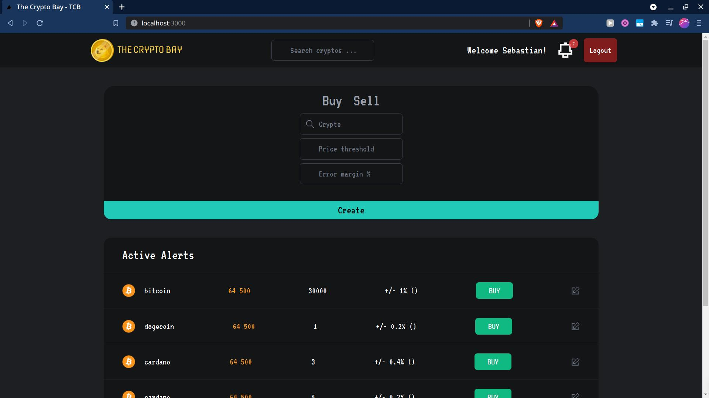
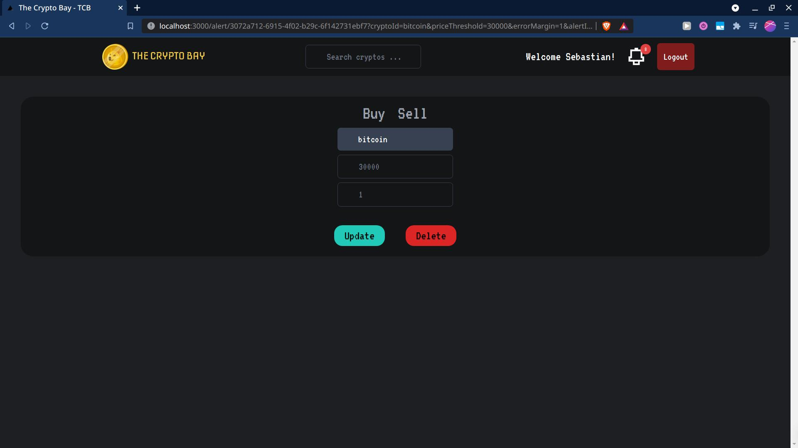

# Crypto Signals

This page sends you a notification whenever a price of a crypto reaches the threshold you desire. It uses a scheduled function that checks every minute if any alert has been triggered and sends you the notification via websockets. This could potentially serve as a backbone for sending alerts through other services such as mail, or chat applications like telegram.

## Usage

- Frontend launch with:

```
  yarn install
  yarn dev
```

- Backend with:

```
  sls deploy --verbose
```

Crypto ids are the same as the ones used in the [CoinGecko API](https://www.coingecko.com/en/api).
Inputs for criptos can be retreived from calling the [list operation](https://www.coingecko.com/en/api/documentation). Some of them include: `bitcoin`, `cardano`, `dogecoin`.

## Features

- Signup/Login with Auth0
- User can perform a CRUD on Buy/Sell Alerts (Personal)
  - Alerts have the following attributes:
    - Target Price: Number
    - Tolerance(%): Error that user is willing to accept for the alert to trigger.
    - Active: True/False (Indicates if alert has been triggered)
- If a threshold is surpassed the counter on top of the bell will increase for each notification.

## Extra

- Frontend was developed using Nextjs

## Screenshots

### Main page



### Edit alert


